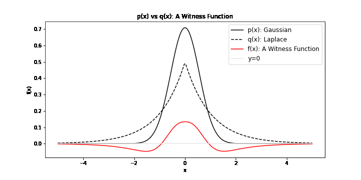
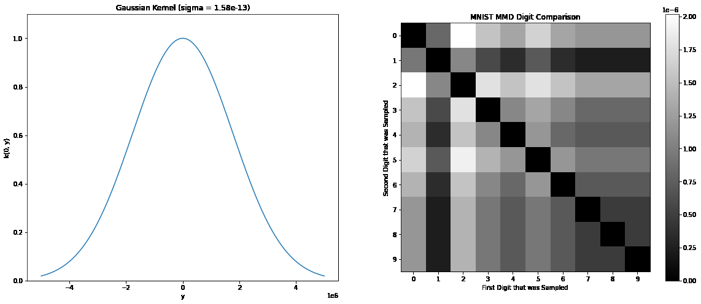
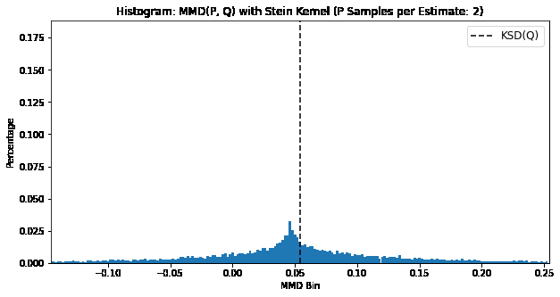

# Distribution Discrepancies
- Maximum Mean Discrepancy
- Kernel Stein Discrepancy
- Fisher Divergence

For more information, check out [my KSD blog post](https://jswu18.github.io/blog-posts/the-kernel-stein-discrepancy.html)!


To get set up:

1. Install `poetry`

```shell
pip install poetry
```

2. Install dependencies

```shell
poetry install
```

## Integral Probability Metrics (IPMS)

Integral Probability Metrics (IPMs) are a comparison of two distribution under the transformation of some f in a function space F. In particular we search for f*, a witness function, a transformation that *maximimally* exposes the differences of x ~ P and y ~ Q.

<figure class="image" align="center">
  
  <figcaption> We can visualise possible witness functions when P is Gaussian and Q follows a Laplace distribution
  </figcaption> 
</figure>


## The Maximum Mean Discrepancy (MMD)

One example of an IPM is the Maximum Mean Discrepancy (MMD). The MMD is able to compare sets of samples from two distributions. As an example, we can calculate the MMD between MNIST images of two binary digits. 

<figure class="image" align="center">
  
  <figcaption> We can see the effect of the kernel hyper-parameters on the ability of the MMD to discriminate between MNIST digits
  </figcaption> 
</figure>

## The Langevin Kernel Stein Discrepancy (KSD)

The Langevin Kernel Stein Discrepancy compares one set of samples from an unknown distribution with the density of a known distribution. It turns out that the MMD can be viewed as an approximation of the KSD when using the Langevin Stein Kernel. We can visualise this by seeing the MMD approach the KSD:

<figure class="image" align="center">
  
  <figcaption> When using the Langevin Stein Kernel, we can see the MMD is a numerical approximation of the KSD
  </figcaption> 
</figure>

## The Langevin Stein Kernel

The Langevin Stein Kernel has a complex mathematical formulation. We can break down the separate terms to better understand the different components:

<figure class="image" align="center">
  
  <figcaption> The Langevin Stein Kernel for the Laplace Distribution 
  </figcaption> 
</figure>

<figure class="image" align="center">
  
  <figcaption> The Langevin Stein Kernel for the Cauchy Distribution 
  </figcaption> 
</figure>
